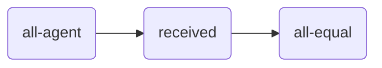
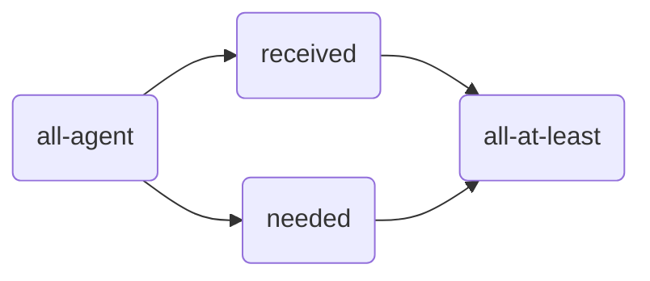

<head>
  
</head>

# [Tiles](https://julianmendez.github.io/tiles/)

[][license]
[][build-status]

**Tiles** is a framework to create formal configurations of constraints. Its classes are
written in [Soda][soda] and grouped in packages translated to
[Scala][scala].

The fairness tiles are defined in [package tile][package-tile]
[(Scala translation)][package-tile-scala] and they use entities and other tools defined in
[package tool][package-tool] [(Scala translation)][package-tool-scala].

## Publications

* 
  Julian Alfredo Mendez, Timotheus Kampik, Andrea Aler Tubella, and Virginia Dignum. **A Clearer View on Fairness:
  Visual and Formal Representation for Comparative Analysis**. In Florian Westphal, Einav Peretz-Andersson, Maria
  Riveiro, Kerstin Bach, and Fredrik Heintz, editors, *14th Scandinavian Conference on Artificial Intelligence, SCAI
  2024*, pages 112-120. Swedish Artificial Intelligence Society, June 2024.
  &nbsp; DOI:[10.3384/ecp208013][tiles-doi]
  &nbsp; [Abstract][tiles-abstract]
  &nbsp; [BibTeX][tiles-bibtex]
  &nbsp; [PDF][tiles-pdf]
  &nbsp; [Implementation][tiles-impl]
* 
  Julian Alfredo Mendez.
  **Soda: An Object-Oriented Functional Language for Specifying Human-Centered Problems**.
  arXiv
  &nbsp; DOI:[10.48550/arXiv.2310.01961][soda-doi]
  &nbsp; [Abstract][soda-abstract]
  &nbsp; [BibTeX][soda-bibtex]
  &nbsp; [PDF][soda-pdf]
  &nbsp; [Implementation][soda-impl]

## Example

This project includes an executable example of [Child Care Subsidy][ccs-example] pipelines.
The script `makeall.sh` creates the file `tiles`, which is an executable JAR file that can be
directly executed in Linux. Its input is a [YAML][yaml] configuration file, like the
[configuration file][test-yaml-conf] provided for the unit tests. For more details, see the
[Child Care Subsidy example][ccs-example].

## Resource Allocation Scenarios

These are some of the implemented fairness tiles for resource allocation scenarios:

| Tile                                                | Class                                    |
|:----------------------------------------------------|:-----------------------------------------|
| all-agent *(a)*                          | [AllAgentTile][AllAgentTile]             |
| *(a)* received *(m)*          | [ReceivedSigmaPTile][ReceivedSigmaPTile] |
| *(m)* all-equal *b*           | [AllEqualTile][AllEqualTile]             |
| *(a)* needed *(m)*            | [NeededPTile][NeededPTile]               |
| *(m0), (m1)* all-at-least *b* | [AllAtLeastTile][AllAtLeastTile]         |
| equality *b*                             | [EqualityPipeline][EqualityPipeline]     |
| equity *b*                               | [EquityPipeline][EquityPipeline]         |

A specific scenario is given as an example
in [ResourceAllocationScenarioExample][ResourceAllocationScenarioExample].
This scenario is used to test the equality tile
with [EqualityPipelineSpec][EqualityPipelineSpec]
and the equity tile
with [EquityPipelineSpec][EquityPipelineSpec].

### Example of Equality

### Example of Equity

### Auxiliary Tiles

The auxiliary tiles are used in the construction of other tiles. Some of the auxiliary tiles
are:

| Tile                                                                        | Class                                |
|:----------------------------------------------------------------------------|:-------------------------------------|
| *(a)* map *(m)*                                       | [MapTile][MapTile]                   |
| *(m0), (m1)* &sigma; *(m)*                            | [SigmaTile][SigmaTile]               |
| *(&alpha;0), (&alpha;1)* zip *(⟨&alpha;0, &alpha;1⟩)* | [ZipTile][ZipTile]                   |
| *(⟨&alpha;0, &alpha;1⟩)* unzip-0 *(&alpha;0)*         | [UnzipPairFstTile][UnzipPairFstTile] |
| *(⟨&alpha;0, &alpha;1⟩)* unzip-1 *(&alpha;1)*         | [UnzipPairSndTile][UnzipPairSndTile] |

### More examples

* [Scoring Example][scoring-example]

## Author

[Julian Alfredo Mendez][author]

[tiles-doi]: https://doi.org/10.3384/ecp208013

[tiles-abstract]: https://ecp.ep.liu.se/index.php/sais/article/view/1005

[tiles-bibtex]: https://julianmendez.github.io/tiles/bibtex-2024.html

[tiles-pdf]: https://ecp.ep.liu.se/index.php/sais/article/view/1005/913

[tiles-impl]: https://github.com/julianmendez/tiles

[soda-doi]: https://doi.org/10.48550/arXiv.2310.01961

[soda-abstract]: https://arxiv.org/abs/2310.01961

[soda-bibtex]: https://julianmendez.github.io/soda/bibtex-2023.html

[soda-pdf]: https://arxiv.org/pdf/2310.01961

[soda-impl]: https://github.com/julianmendez/soda

[author]: https://julianmendez.github.io

[license]: https://www.apache.org/licenses/LICENSE-2.0.txt

[build-status]: https://github.com/julianmendez/tiles/actions

[release-notes]: https://julianmendez.github.io/tiles/RELEASE-NOTES.html

[soda]: https://github.com/julianmendez/soda

[scala]: https://scala-lang.org

[yaml]: https://yaml.org

[package-tile]: https://github.com/julianmendez/tiles/tree/master/core/src/main/scala/soda/tiles/fairness/tile

[package-tile-scala]: https://github.com/julianmendez/tiles/blob/master/core/src/main/scala/soda/tiles/fairness/tile/Package.scala

[package-tool]: https://github.com/julianmendez/tiles/tree/master/core/src/main/scala/soda/tiles/fairness/tool

[package-tool-scala]: https://github.com/julianmendez/tiles/blob/master/core/src/main/scala/soda/tiles/fairness/tool/Package.scala

[AllAgentTile]: https://github.com/julianmendez/tiles/blob/master/core/src/main/scala/soda/tiles/fairness/tile/constant/AllAgentTile.soda

[ReceivedSigmaPTile]: https://github.com/julianmendez/tiles/blob/master/core/src/main/scala/soda/tiles/fairness/tile/fold/ReceivedSigmaPTile.soda

[AllEqualTile]: https://github.com/julianmendez/tiles/blob/master/core/src/main/scala/soda/tiles/fairness/tile/fold/AllEqualTile.soda

[NeededPTile]: https://github.com/julianmendez/tiles/blob/master/core/src/main/scala/soda/tiles/fairness/tile/map/NeededPTile.soda

[AllAtLeastTile]: https://github.com/julianmendez/tiles/blob/master/core/src/main/scala/soda/tiles/fairness/tile/fold/AllAtLeastTile.soda

[EqualityPipeline]: https://github.com/julianmendez/tiles/blob/master/core/src/main/scala/soda/tiles/fairness/pipeline/EqualityPipeline.soda

[EquityPipeline]: https://github.com/julianmendez/tiles/blob/master/core/src/main/scala/soda/tiles/fairness/pipeline/EquityPipeline.soda

[MapTile]: https://github.com/julianmendez/tiles/blob/master/core/src/main/scala/soda/tiles/fairness/tile/map/MapTile.soda

[SigmaTile]: https://github.com/julianmendez/tiles/blob/master/core/src/main/scala/soda/tiles/fairness/tile/fold/SigmaTile.soda

[ZipTile]: https://github.com/julianmendez/tiles/blob/master/core/src/main/scala/soda/tiles/fairness/tile/zip/ZipTile.soda

[UnzipPairFstTile]: https://github.com/julianmendez/tiles/blob/master/core/src/main/scala/soda/tiles/fairness/tile/map/UnzipPairFstTile.soda

[UnzipPairSndTile]: https://github.com/julianmendez/tiles/blob/master/core/src/main/scala/soda/tiles/fairness/tile/map/UnzipPairSndTile.soda

[ResourceAllocationScenarioExample]: https://github.com/julianmendez/tiles/blob/master/core/src/test/scala/soda/tiles/fairness/pipeline/ResourceAllocationScenarioExample.soda

[EqualityPipelineSpec]: https://github.com/julianmendez/tiles/blob/master/core/src/test/scala/soda/tiles/fairness/pipeline/EqualityPipelineSpec.soda

[EquityPipelineSpec]: https://github.com/julianmendez/tiles/blob/master/core/src/test/scala/soda/tiles/fairness/pipeline/EquityPipelineSpec.soda

[ccs-example]: https://julianmendez.github.io/tiles/ccs_example.html

[test-yaml-conf]: https://github.com/julianmendez/tiles/blob/master/examples/src/test/resources/example/example0.yaml

[scoring-example]: https://julianmendez.github.io/tiles/scoring_example.html

