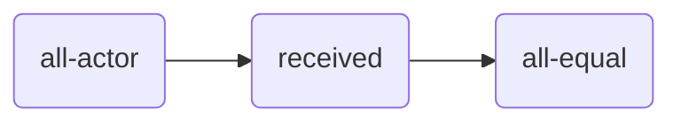

<head>
  
</head>

# [Tiles](https://julianmendez.github.io/tiles/)

[][license]
[][build-status]

**Tiles** is a framework to create formal configurations of constraints. Its classes are
written in [Soda][soda] and grouped in packages translated to
[Scala][scala].

The fairness tiles are defined in [package tile][package-tile]
[(Scala translation)][package-tile-scala] and they use entities and other tools defined in
[package tool][package-tool] [(Scala translation)][package-tool-scala].

## Resource Allocation Scenarios

These are some of the implemented fairness tiles for resource allocation scenarios:

| Tile                                                | Class                                       |
|:----------------------------------------------------|:--------------------------------------------|
| all-actor *(a)*                          | [AllActorTile][all-actor-tile]              |
| *(a)* received *(m)*          | [ReceivedSigmaPTile][received-sigma-p-tile] |
| *(m)* all-equal *b*           | [AllEqualTile][all-equal-tile]              |
| *(a)* needed *(m)*            | [NeededPTile][needed-p-tile]                |
| *(m0), (m1)* all-at-least *b* | [AllAtLeastTile][all-at-least-tile]         |
| equality *b*                             | [EqualityPipeline][equality-pipeline]       |
| equity *b*                               | [EquityPipeline][equity-pipeline]           |

A specific scenario is given as an example
in [ResourceAllocationScenarioExample][resource-allocation-scenario-example].
This scenario is used to test the equality tile
with [EqualityPipelineSpec][equality-pipeline-spec]
and the equity tile
with [EquityPipelineSpec][equity-pipeline-spec].

### Example of Equality

### Example of Equity

### Auxiliary Tiles

The auxiliary tiles are used in the construction of other tiles. Some of the auxiliary tiles
are:

| Tile                                                                     | Class                                   |
|:-------------------------------------------------------------------------|:----------------------------------------|
| *(a)* attribute *(m)*                              | [AttributePTile][attribute-p-tile]      |
| *(m0), (m1)* &sigma; *(m)*                         | [SigmaTile][sigma-tile]                 |
| *(&alpha;0),(&alpha;1)* zip *(&alpha;0, &alpha;1)* | [ZipTile][zip-tile]                     |
| *(&alpha;0, &alpha;1)* unzip-0 *(&alpha;0)*        | [UnzipPairFstTile][unzip-pair-fst-tile] |
| *(&alpha;0, &alpha;1)* unzip-1 *(&alpha;1)*        | [UnzipPairSndTile][unzip-pair-snd-tile] |

### More examples

* [Child Care Subsidy][ccs-example]
* [Scoring Example][scoring-example]

## Author

[Julian Alfredo Mendez][author]

[author]: https://julianmendez.github.io
[license]: https://www.apache.org/licenses/LICENSE-2.0.txt
[build-status]: https://github.com/julianmendez/tiles/actions
[release-notes]: https://julianmendez.github.io/tiles/RELEASE-NOTES.html
[soda]: https://github.com/julianmendez/soda
[scala]: https://scala-lang.org
[package-tile]: https://github.com/julianmendez/tiles/tree/master/core/src/main/scala/soda/tiles/fairness/tile
[package-tile-scala]: https://github.com/julianmendez/tiles/blob/master/core/src/main/scala/soda/tiles/fairness/tile/Package.scala
[package-tool]: https://github.com/julianmendez/tiles/tree/master/core/src/main/scala/soda/tiles/fairness/tool
[package-tool-scala]: https://github.com/julianmendez/tiles/blob/master/core/src/main/scala/soda/tiles/fairness/tool/Package.scala
[all-actor-tile]: https://github.com/julianmendez/tiles/blob/master/core/src/main/scala/soda/tiles/fairness/tile/AllActorTile.soda
[received-sigma-p-tile]: https://github.com/julianmendez/tiles/blob/master/core/src/main/scala/soda/tiles/fairness/tile/ReceivedSigmaPTile.soda
[all-equal-tile]: https://github.com/julianmendez/tiles/blob/master/core/src/main/scala/soda/tiles/fairness/tile/AllEqualTile.soda
[needed-p-tile]: https://github.com/julianmendez/tiles/blob/master/core/src/main/scala/soda/tiles/fairness/tile/NeededPTile.soda
[all-at-least-tile]: https://github.com/julianmendez/tiles/blob/master/core/src/main/scala/soda/tiles/fairness/tile/AllAtLeastTile.soda
[equality-pipeline]: https://github.com/julianmendez/tiles/blob/master/core/src/main/scala/soda/tiles/fairness/pipeline/EqualityPipeline.soda
[equity-pipeline]: https://github.com/julianmendez/tiles/blob/master/core/src/main/scala/soda/tiles/fairness/pipeline/EquityPipeline.soda
[attribute-p-tile]: https://github.com/julianmendez/tiles/blob/master/core/src/main/scala/soda/tiles/fairness/tile/AttributePTile.soda
[sigma-tile]: https://github.com/julianmendez/tiles/blob/master/core/src/main/scala/soda/tiles/fairness/tile/SigmaTile.soda
[zip-tile]: https://github.com/julianmendez/tiles/blob/master/core/src/main/scala/soda/tiles/fairness/tile/ZipTile.soda
[unzip-pair-fst-tile]: https://github.com/julianmendez/tiles/blob/master/core/src/main/scala/soda/tiles/fairness/tile/UnzipPairFstTile.soda
[unzip-pair-snd-tile]: https://github.com/julianmendez/tiles/blob/master/core/src/main/scala/soda/tiles/fairness/tile/UnzipPairSndTile.soda
[resource-allocation-scenario-example]: https://github.com/julianmendez/tiles/blob/master/core/src/test/scala/soda/tiles/fairness/pipeline/ResourceAllocationScenarioExample.soda
[equality-pipeline-spec]: https://github.com/julianmendez/tiles/blob/master/core/src/test/scala/soda/tiles/fairness/pipeline/EqualityPipelineSpec.soda
[equity-pipeline-spec]: https://github.com/julianmendez/tiles/blob/master/core/src/test/scala/soda/tiles/fairness/pipeline/EquityPipelineSpec.soda
[ccs-example]: ccs_example.html
[scoring-example]: scoring_example.html

