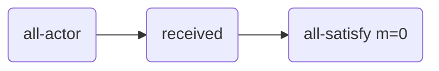
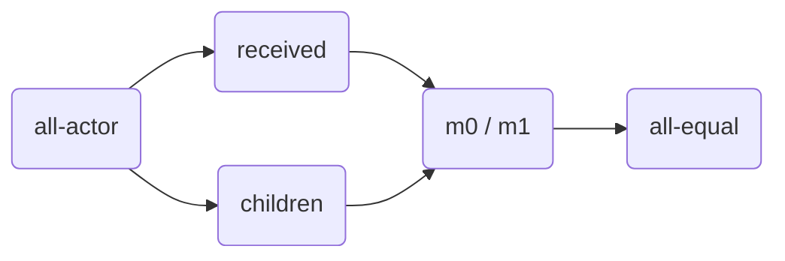
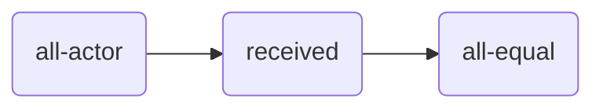
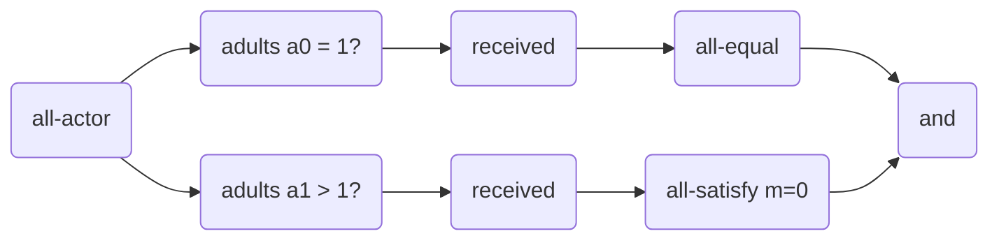

<head>
  
</head>

## Child Care Subsidy Example

### CcsNoSubsidyPipeline

```mermaid
graph LR
  all-actor(all-actor) --> received
  received(received) --> all-satisfy-0(all-satisfy m=0)
```

### CcsPerChildPipeline

```mermaid
graph LR
  all-actor(all-actor) --> received
  all-actor --> children
  received(received) --> m0/m1
  children(children) --> m0/m1
  m0/m1(m0 / m1) --> all-equal(all-equal)
```

### CcsPerFamilyPipeline

```mermaid
graph LR
  all-actor(all-actor) --> received
  received(received) --> all-equal(all-equal)
```

### CcsSingleGuardianPipeline

```mermaid
graph LR
  all-actor(all-actor) --> adults-1
  all-actor --> adults-2
  adults-1(adults a0 = 1?) --> received-1
  adults-2(adults a1 > 1?) --> received-0
  received-1(received) --> all-equal
  received-0(received) --> all-satisfy-0
  all-equal(all-equal) --> and(and)
  all-satisfy-0(all-satisfy m=0) --> and
```

