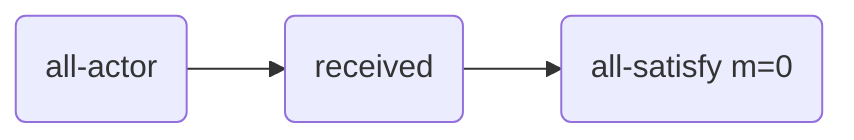
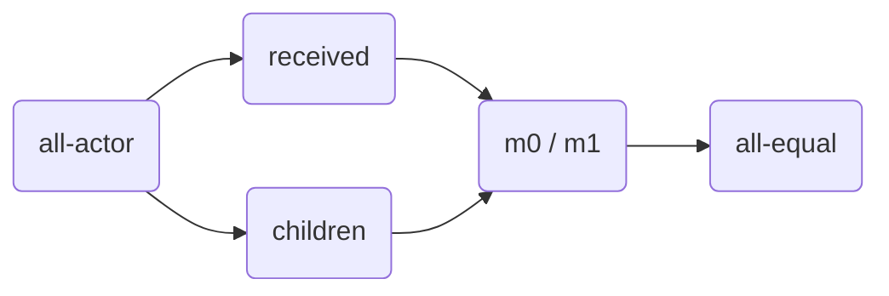
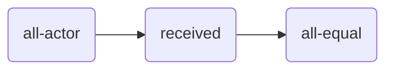
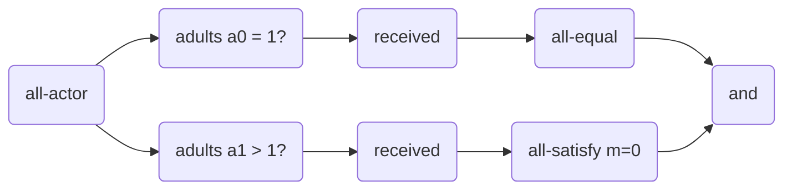

<head>
  
</head>

## Child Care Subsidy Example

| Tile                                                | Class                                    |
|:----------------------------------------------------|:-----------------------------------------|
| all-actor *(a)*                          | [AllActorTile][AllActorTile]             |
| *(a)* received *(m)*          | [ReceivedSigmaPTile][ReceivedSigmaPTile] |
| *(m)* all-satisfy (p) *b*     | [AllSatisfyPTile][AllSatisfyPTile]       |
| *(m)* all-equal *b*           | [AllEqualTile][AllEqualTile]             |
| *(a)* p *(m)*                 | [AttributePTile][AttributePTile]         |
| *(a)* p ? *(a)*               | [FilterActorTile][FilterActorTile]       |
| *(m0), (m1)* all-at-least *b* | [AllAtLeastTile][AllAtLeastTile]         |
| *(m0), (m1)* f (m0,m1) *(m)*  | [SigmaTile][SigmaTile]                   |
| *b0, b1* f (b0,b1) *b*  | [CombineBooleanTile][CombineBooleanTile]          |

### No Child Care Subsidy

This is the [No Subsidy Pipeline][CcsNoSubsidyPipeline].

### Child Care Subsidy Per Child Pipeline

This is the [Per Child Pipeline][CcsPerChildPipeline].

### Child Care Subsidy Per Family Pipeline

This is the [Per Family Pipeline][CcsPerFamilyPipeline].

### Child Card Subsidy to Single Guardian Pipeline

This is the [Single Guardian Pipeline][CcsSingleGuardianPipeline].

[AllActorTile]: https://github.com/julianmendez/tiles/blob/master/core/src/main/scala/soda/tiles/fairness/tile/AllActorTile.soda
[ReceivedSigmaPTile]: https://github.com/julianmendez/tiles/blob/master/core/src/main/scala/soda/tiles/fairness/tile/ReceivedSigmaPTile.soda
[AllSatisfyPTile]: https://github.com/julianmendez/tiles/blob/master/core/src/main/scala/soda/tiles/fairness/tile/AllSatisfyPTile.soda
[AllEqualTile]: https://github.com/julianmendez/tiles/blob/master/core/src/main/scala/soda/tiles/fairness/tile/AllEqualTile.soda
[AttributePTile]: https://github.com/julianmendez/tiles/blob/master/core/src/main/scala/soda/tiles/fairness/tile/AttributePTile.soda
[FilterActorTile]: https://github.com/julianmendez/tiles/blob/master/core/src/main/scala/soda/tiles/fairness/tile/FilterActorTile.soda
[AllAtLeastTile]: https://github.com/julianmendez/tiles/blob/master/core/src/main/scala/soda/tiles/fairness/tile/AllAtLeastTile.soda
[SigmaTile]: https://github.com/julianmendez/tiles/blob/master/core/src/main/scala/soda/tiles/fairness/tile/SigmaTile.soda
[CombineBooleanTile]: https://github.com/julianmendez/tiles/blob/master/core/src/main/scala/soda/tiles/fairness/tile/CombineBooleanTile.soda
[CcsSingleGuardianPipeline]: https://github.com/julianmendez/tiles/blob/master/examples/src/main/scala/soda/tiles/fairness/example/childcaresubsidy/CcsSingleGuardianPipeline.soda
[CcsNoSubsidyPipeline]: https://github.com/julianmendez/tiles/blob/master/examples/src/main/scala/soda/tiles/fairness/example/childcaresubsidy/CcsNoSubsidyPipeline.soda
[CcsPerChildPipeline]: https://github.com/julianmendez/tiles/blob/master/examples/src/main/scala/soda/tiles/fairness/example/childcaresubsidy/CcsPerChildPipeline.soda
[CcsPerFamilyPipeline]: https://github.com/julianmendez/tiles/blob/master/examples/src/main/scala/soda/tiles/fairness/example/childcaresubsidy/CcsPerFamilyPipeline.soda

