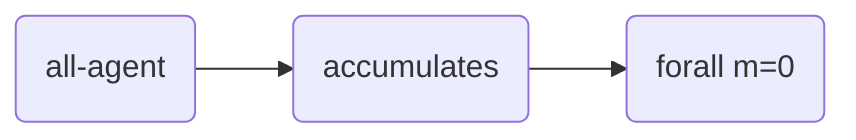
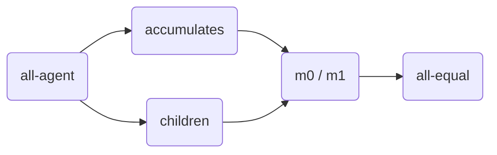
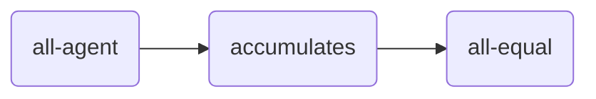
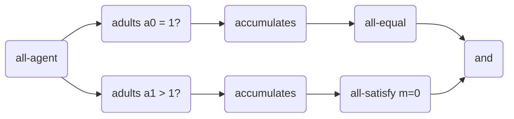

<head>
  <script src="https://cdnjs.cloudflare.com/ajax/libs/mermaid/9.4.3/mermaid.min.js"> </script>
</head>


## Child Care Subsidy Example

The Child Care Subsidy (CCS) is a financial assistance to help families with the cost of
child care. For example, the amount given by the Australian Government depends on the
[family circumstances][australian-conditions]. In this example, we explore different
criteria to define a fair distribution of the child care subsidy. Each criterion is defined
by a pipeline, as described in the next sections.

This project includes an **executable example** of Child Care Subsidy pipelines. The script
`makeall.sh` creates the file `tiles`, which is an executable JAR file that can be directly
executed in Linux. Its input is a [YAML][yaml] configuration file, like the
[configuration file][test-yaml-conf] provided for the unit tests. A simplified version is
shown below.

```yaml
---


## Tiles (https://julianmendez.github.io/tiles/)


## Agents for this scenario
agents:
  family A: .


## Resources for this scenario
resources:
  subsidy 100: .


## Number of children in each family.
agent_children:
  family A: 2


## Number of guardians in each family.
agent_adults:
  family A: 2


## Total income in each family.
agent_income:
  family A: 2000


## The value of each resource.
resource_value:
  subsidy 100: 100


## The resources received by the family, checked by the pipeline.
outcome:
  family A: subsidy 100


## Pipelines that can test the provided data.
pipelines:
  CcsNoSubsidyPipeline: .
  CcsPerChildPipeline: .
  CcsPerFamilyPipeline: .
  CcsSingleGuardianPipeline: .
```

This example is modeled with Tiles, where each agent is a family. The families (`agents`)
and subsidies (`resources`) have identifiers. In addition, the resources have some value (
`resource_value`). The assignments (`outcome`) relate agents with resources. Some of the
properties that each family has are: number of adults in the family (`agent_adults`) and
number of children in the family (`agent_children`). All the pipelines to be tested have
their own section (`pipelines`).


### Tiles used

| Tile                                                | Class                                    | Formerly  |
|:----------------------------------------------------|:-----------------------------------------|:----------|
| all-agent <sub>*(a)*</sub>                          | [AllAgentTile][AllAgentTile]             | all-actor |
| <sub>*(a)*</sub> accumulates <sub>*(m)*</sub>       | [ReceivedSigmaPTile][ReceivedSigmaPTile] | received  |
| <sub>*(m)*</sub> forall (p) <sub>*b*</sub>          | [ForallTile][ForallTile]                 |           |
| <sub>*(m)*</sub> all-equal <sub>*b*</sub>           | [AllEqualTile][AllEqualTile]             |           |
| <sub>*(a)*</sub> p <sub>*(m)*</sub>                 | [MapTile][MapTile]                       |           |
| <sub>*(a)*</sub> p ? <sub>*(a)*</sub>               | [FilterTile][FilterTile]                 |           |
| <sub>*(m0), (m1)*</sub> all-at-least <sub>*b*</sub> | [AllAtLeastTile][AllAtLeastTile]         |           |
| <sub>*(m0), (m1)*</sub> f (m0, m1) <sub>*(m)*</sub> | [SigmaTile][SigmaTile]                   |           |
| <sub>*b0, b1*</sub> f (b0, b1) <sub>*b*</sub>       | [CombineBooleanTile][CombineBooleanTile] |           |


### No Child Care Subsidy

This is the [No Subsidy Pipeline][CcsNoSubsidyPipeline]. In this case, no subsidy is given to any family.




### Child Care Subsidy Per Child Pipeline

This is the [Per Child Pipeline][CcsPerChildPipeline]. In this case, the amount of money
given to each family depends on the number of children in the family.




### Child Care Subsidy Per Family Pipeline

This is the [Per Family Pipeline][CcsPerFamilyPipeline]. In this case, the amount of money
given to each family is the same, regardless of the number of children in the family.




### Child Card Subsidy to Single Guardian Pipeline

This is the [Single Guardian Pipeline][CcsSingleGuardianPipeline]. In this case, the subsidy
is only granted to families having a single guardian.



[yaml]: https://yaml.org

[AllAgentTile]: https://github.com/julianmendez/tiles/blob/master/core/src/main/scala/soda/tiles/fairness/tile/constant/AllAgentTile.soda

[ReceivedSigmaPTile]: https://github.com/julianmendez/tiles/blob/master/core/src/main/scala/soda/tiles/fairness/tile/composite/ReceivedSigmaPTile.soda

[ForallTile]: https://github.com/julianmendez/tiles/blob/master/core/src/main/scala/soda/tiles/fairness/tile/composite/ForallTile.soda

[AllEqualTile]: https://github.com/julianmendez/tiles/blob/master/core/src/main/scala/soda/tiles/fairness/tile/composite/AllEqualTile.soda

[MapTile]: https://github.com/julianmendez/tiles/blob/master/core/src/main/scala/soda/tiles/fairness/tile/primitive/MapTile.soda

[FilterTile]: https://github.com/julianmendez/tiles/blob/master/core/src/main/scala/soda/tiles/fairness/tile/primitive/FilterTile.soda

[AllAtLeastTile]: https://github.com/julianmendez/tiles/blob/master/core/src/main/scala/soda/tiles/fairness/tile/composite/AllAtLeastTile.soda

[SigmaTile]: https://github.com/julianmendez/tiles/blob/master/core/src/main/scala/soda/tiles/fairness/tile/composite/SigmaTile.soda

[CombineBooleanTile]: https://github.com/julianmendez/tiles/blob/master/core/src/main/scala/soda/tiles/fairness/tile/derived/apply/CombineBooleanTile.soda

[CcsSingleGuardianPipeline]: https://github.com/julianmendez/tiles/blob/master/examples/src/main/scala/soda/tiles/fairness/example/childcaresubsidy/CcsSingleGuardianPipeline.soda

[CcsNoSubsidyPipeline]: https://github.com/julianmendez/tiles/blob/master/examples/src/main/scala/soda/tiles/fairness/example/childcaresubsidy/CcsNoSubsidyPipeline.soda

[CcsPerChildPipeline]: https://github.com/julianmendez/tiles/blob/master/examples/src/main/scala/soda/tiles/fairness/example/childcaresubsidy/CcsPerChildPipeline.soda

[CcsPerFamilyPipeline]: https://github.com/julianmendez/tiles/blob/master/examples/src/main/scala/soda/tiles/fairness/example/childcaresubsidy/CcsPerFamilyPipeline.soda

[test-yaml-conf]: https://github.com/julianmendez/tiles/blob/master/examples/src/test/resources/example/example0.yaml

[australian-conditions]: https://www.servicesaustralia.gov.au/how-much-child-care-subsidy-you-can-get?context=41186

<script>
  window.mermaid.init(undefined, document.querySelectorAll('.language-mermaid'));
</script>


