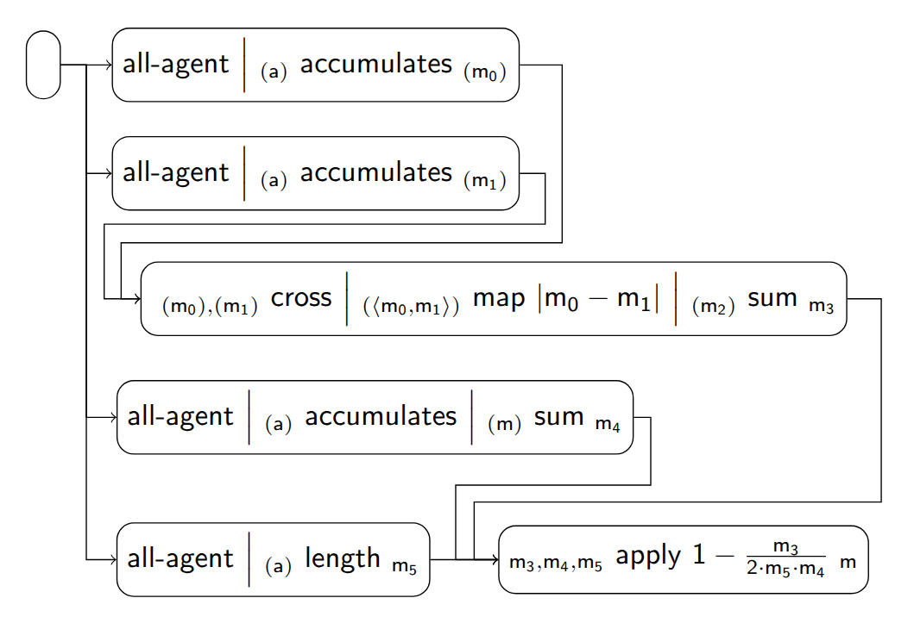

### Scenario of the Complement of the Gini Index

These are some of the implemented fairness tiles for the scenario:

| Index | Tile or Pipeline                                 | Class                                                      |
|:------|:-------------------------------------------------|:-----------------------------------------------------------|
| 1     | all-agent *(a)*                       | [AllAgentTile][AllAgentTile]                               |
| 2     | *(a)* accumulates *(m)*    | [AccumulatesTile][AccumulatesTile]                         |
| 3     | *(α),(β)* cross *(⟨α, β⟩)* | [CrossTile][CrossTile]                                     |
| 4     | *(m)* sum *m*              | [SumTile][SumTile]                                         |
| 5     | *(α)* map ϕ *(β)*          | [MapTile][MapTile]                                         |
| 6     | *(α)* length *m*           | [LengthTile][LengthTile]                                   |
| 7     | *α* apply ϕ *β*            | [ApplyTile][ApplyTile]                                     |
| 8     | composite (1 + 2)                                | [AllAgentAccumulatesTile][AllAgentAccumulatesTile]         |
| 9     | composite (1 + 2)                                | [AllAgentAccumulatesTile][AllAgentAccumulatesTile]         |
| 10    | composite (3 + 5 + 4)                            | [CrossMapSumTile][CrossMapSumTile]                         |
| 11    | composite (1 + 2 + 4)                            | [AllAgentAccumulatesSumTile][AllAgentAccumulatesSumTile]   |
| 12    | composite (1 + 5)                                | [AllAgentLengthTile][AllAgentLengthTile]                   |
| 13    | pipeline (10 + 11 + 12)                          | [ComplementGiniIndexPipeline][ComplementGiniIndexPipeline] |

[AllAgentTile]: https://github.com/julianmendez/tiles/blob/master/core/src/main/scala/soda/tiles/fairness/tile/constant/AllAgentTile.soda

[AccumulatesTile]: https://github.com/julianmendez/tiles/blob/master/core/src/main/scala/soda/tiles/fairness/tile/composite/AccumulatesTile.soda

[CrossTile]: https://github.com/julianmendez/tiles/blob/master/core/src/main/scala/soda/tiles/fairness/tile/primitive/CrossTile.soda

[SumTile]: https://github.com/julianmendez/tiles/blob/master/core/src/main/scala/soda/tiles/fairness/tile/derived/fold/SumTile.soda

[MapTile]: https://github.com/julianmendez/tiles/blob/master/core/src/main/scala/soda/tiles/fairness/tile/primitive/MapTile.soda

[LengthTile]: https://github.com/julianmendez/tiles/blob/master/core/src/main/scala/soda/tiles/fairness/tile/derived/fold/LengthTile.soda

[ApplyTile]: https://github.com/julianmendez/tiles/blob/master/core/src/main/scala/soda/tiles/fairness/tile/primitive/ApplyTile.soda

[AllAgentAccumulatesTile]: https://github.com/julianmendez/tiles/blob/master/examples/src/main/scala/soda/tiles/fairness/example/pipeline/complementginiindex/AllAgentAccumulatesTile.soda

[CrossMapSumTile]: https://github.com/julianmendez/tiles/blob/master/examples/src/main/scala/soda/tiles/fairness/example/pipeline/complementginiindex/CrossMapSumTile.soda

[AllAgentAccumulatesSumTile]: https://github.com/julianmendez/tiles/blob/master/examples/src/main/scala/soda/tiles/fairness/example/pipeline/complementginiindex/AllAgentAccumulatesSumTile.soda

[AllAgentLengthTile]: https://github.com/julianmendez/tiles/blob/master/examples/src/main/scala/soda/tiles/fairness/example/pipeline/complementginiindex/AllAgentLengthTile.soda

[ComplementGiniIndexPipeline]: https://github.com/julianmendez/tiles/blob/master/examples/src/main/scala/soda/tiles/fairness/example/pipeline/complementginiindex/ComplementGiniIndexPipeline.soda

