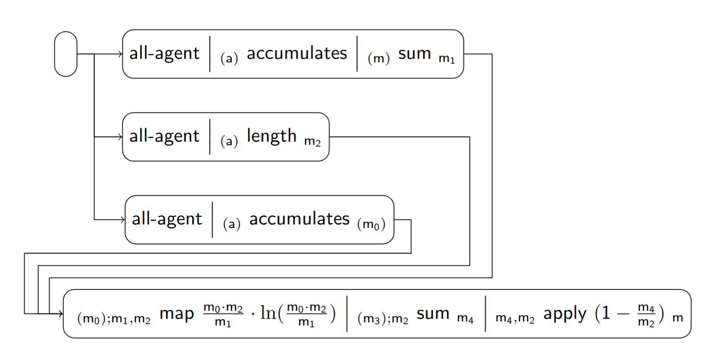

### Scenario of the Complement of the Theil Index

These are some of the implemented fairness tiles for the scenario:

| Index | Tile or Pipeline                              | Class                                                        |
|:------|:----------------------------------------------|:-------------------------------------------------------------|
| 1     | all-agent *(a)*                    | [AllAgentTile][AllAgentTile]                                 |
| 2     | *(a)* accumulates *(m)* | [AccumulatesTile][AccumulatesTile]                           |
| 3     | *(m)* sum *m*           | [SumPhiNumberTile][SumPhiNumberTile]                         |
| 4     | *(α)* length *m*        | [LengthTile][LengthTile]                                     |
| 5     | *α* apply φ *β*         | [ApplyTile][ApplyTile]                                       |
| 6     | *(α)* map φ *(β)*       | [MapTile][MapTile]                                           |
| 7     | composite (1 + 2 + 3)                         | [AllAgentAccumulatesSumTile][AllAgentAccumulatesSumTile]     |
| 8     | composite (1 + 4)                             | [AllAgentLengthTile][AllAgentLengthTile]                     |
| 9     | composite (1 + 2)                             | [AllAgentAccumulatesTile][AllAgentAccumulatesTile]     |
| 10    | composite (6 + 3 + 5)                         | [MapSumApplyTile][MapSumApplyTile]                        |
| 11    | pipeline (7 + 8 + 9 + 10)                     | [ComplementTheilIndexPipeline][ComplementTheilIndexPipeline] |

[AllAgentTile]: https://github.com/julianmendez/tiles/blob/master/core/src/main/scala/soda/tiles/fairness/tile/constant/AllAgentTile.soda

[AccumulatesTile]: https://github.com/julianmendez/tiles/blob/master/core/src/main/scala/soda/tiles/fairness/tile/composite/AccumulatesTile.soda

[CrossTile]: https://github.com/julianmendez/tiles/blob/master/core/src/main/scala/soda/tiles/fairness/tile/primitive/CrossTile.soda

[SumPhiNumberTile]: https://github.com/julianmendez/tiles/blob/master/core/src/main/scala/soda/tiles/fairness/tile/derived/fold/SumPhiNumberTile.soda

[MapTile]: https://github.com/julianmendez/tiles/blob/master/core/src/main/scala/soda/tiles/fairness/tile/primitive/MapTile.soda

[LengthTile]: https://github.com/julianmendez/tiles/blob/master/core/src/main/scala/soda/tiles/fairness/tile/derived/fold/LengthTile.soda

[ApplyTile]: https://github.com/julianmendez/tiles/blob/master/core/src/main/scala/soda/tiles/fairness/tile/primitive/ApplyTile.soda

[AllAgentAccumulatesTile]: https://github.com/julianmendez/tiles/blob/master/examples/src/main/scala/soda/tiles/fairness/example/pipeline/complementtheilindex/AllAgentAccumulatesTile.soda

[CrossMapSumTile]: https://github.com/julianmendez/tiles/blob/master/examples/src/main/scala/soda/tiles/fairness/example/pipeline/complementtheilindex/CrossMapSumTile.soda

[AllAgentAccumulatesSumTile]: https://github.com/julianmendez/tiles/blob/master/examples/src/main/scala/soda/tiles/fairness/example/pipeline/complementtheilindex/AllAgentAccumulatesSumTile.soda

[AllAgentLengthTile]: https://github.com/julianmendez/tiles/blob/master/examples/src/main/scala/soda/tiles/fairness/example/pipeline/complementtheilindex/AllAgentLengthTile.soda

[MapSumApplyTile]: https://github.com/julianmendez/tiles/blob/master/examples/src/main/scala/soda/tiles/fairness/example/pipeline/complementtheilindex/MapSumApplyTile.soda

[ComplementTheilIndexPipeline]: https://github.com/julianmendez/tiles/blob/master/examples/src/main/scala/soda/tiles/fairness/example/pipeline/complementtheilindex/ComplementTheilIndexPipeline.soda

