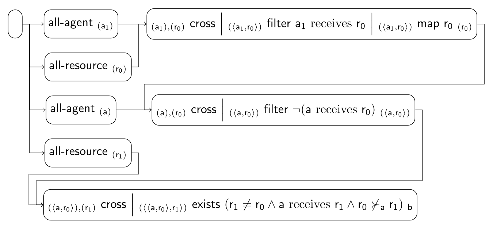

### Envy-Freeness Scenario

These are some of the implemented fairness tiles for the scenario:

| Index | Tile or Pipeline                                 | Class                                        |
|:------|:-------------------------------------------------|:---------------------------------------------|
| 1     | all-agent *(a)*                       | [AllAgentTile][AllAgentTile]                 |
| 2     | all-resource *(r)*                    | [AllResourceTile][AllResourceTile]           |
| 3     | *(α),(β)* cross *(⟨α, β⟩)* | [CrossTile][CrossTile]                       |
| 4     | *(α)* filter ϕ *(α)*       | [FilterTile][FilterTile]                     |
| 5     | *(α)* map ϕ *(β)*          | [MapTile][MapTile]                           |
| 6     | *(α)* exists ϕ *b*         | [ExistsTile][ExistsTile]                     |
| 7     | composite (3 + 4 + 5)                            | [CrossFilterMapTile][CrossFilterMapTile]     |
| 8     | composite (3 + 4)                                | [CrossFilterTile][CrossFilterTile]           |
| 9     | composite (3 + 6)                                | [CrossExistsTile][CrossExistsTile]           |
| 10    | pipeline (7 + 8 + 9)                             | [EnvyFreenessPipeline][EnvyFreenessPipeline] |

[AllAgentTile]: https://github.com/julianmendez/tiles/blob/master/core/src/main/scala/soda/tiles/fairness/tile/constant/AllAgentTile.soda

[AllResourceTile]: https://github.com/julianmendez/tiles/blob/master/core/src/main/scala/soda/tiles/fairness/tile/constant/AllResourceTile.soda

[CrossTile]: https://github.com/julianmendez/tiles/blob/master/core/src/main/scala/soda/tiles/fairness/tile/primitive/CrossTile.soda

[FilterTile]: https://github.com/julianmendez/tiles/blob/master/core/src/main/scala/soda/tiles/fairness/tile/primitive/FilterTile.soda

[MapTile]: https://github.com/julianmendez/tiles/blob/master/core/src/main/scala/soda/tiles/fairness/tile/primitive/MapTile.soda

[ExistsTile]: https://github.com/julianmendez/tiles/blob/master/core/src/main/scala/soda/tiles/fairness/tile/composite/ExistsTile.soda

[CrossFilterMapTile]: https://github.com/julianmendez/tiles/blob/master/examples/src/main/scala/soda/tiles/fairness/example/pipeline/envyfreeness/CrossFilterMapTile.soda

[CrossFilterTile]: https://github.com/julianmendez/tiles/blob/master/examples/src/main/scala/soda/tiles/fairness/example/pipeline/envyfreeness/CrossFilterTile.soda

[CrossExistsTile]: https://github.com/julianmendez/tiles/blob/master/examples/src/main/scala/soda/tiles/fairness/example/pipeline/envyfreeness/CrossExistsTile.soda

[EnvyFreenessPipeline]: https://github.com/julianmendez/tiles/blob/master/examples/src/main/scala/soda/tiles/fairness/example/pipeline/envyfreeness/EnvyFreenessPipeline.soda

