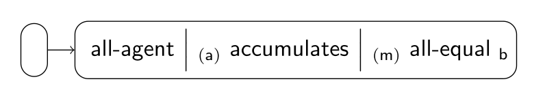
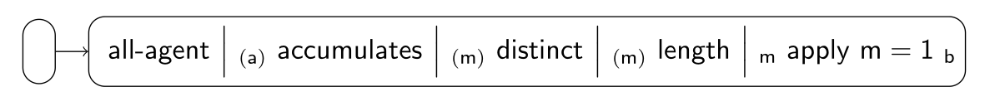

### Equality Scenario

These are some of the implemented fairness tiles for the scenario:

| Index | Tile or Pipeline                              | Class                                |
|:------|:----------------------------------------------|:-------------------------------------|
| 1     | all-agent *(a)*                    | [AllAgentTile][AllAgentTile]         |
| 2     | *(a)* accumulates *(m)* | [AccumulatesTile][AccumulatesTile]   |
| 3     | *(m)* all-equal *b*     | [AllEqualTile][AllEqualTile]         |
| 4     | composite (1 + 2 + 3)                         | [EqualityPipeline][EqualityPipeline] |

Equality can also be modeled as:

| Index | Tile or Pipeline                              | Class                              |
|:------|:----------------------------------------------|:-----------------------------------|
| 1     | all-agent *(a)*                    | [AllAgentTile][AllAgentTile]       |
| 2     | *(a)* accumulates *(m)* | [AccumulatesTile][AccumulatesTile] |
| 3     | *(m)* distinct *(m)*    | [DistinctTile][DistinctTile]       |
| 4     | *(α)* length *m*        | [LengthTile][LengthTile]           |
| 5     | *α* apply *β*           | [ApplyTile][ApplyTile]             |
| 6     | composite (1 + 2 + 3 + 4 + 5)                 |                                    |

[AllAgentTile]: https://github.com/julianmendez/tiles/blob/master/core/src/main/scala/soda/tiles/fairness/tile/constant/AllAgentTile.soda

[AccumulatesTile]: https://github.com/julianmendez/tiles/blob/master/core/src/main/scala/soda/tiles/fairness/tile/composite/AccumulatesTile.soda

[AllEqualTile]: https://github.com/julianmendez/tiles/blob/master/core/src/main/scala/soda/tiles/fairness/tile/composite/AllEqualTile.soda

[DistinctTile]: https://github.com/julianmendez/tiles/blob/master/core/src/main/scala/soda/tiles/fairness/tile/primitive/DistinctTile.soda

[LengthTile]: https://github.com/julianmendez/tiles/blob/master/core/src/main/scala/soda/tiles/fairness/tile/derived/fold/LengthTile.soda

[ApplyTile]: https://github.com/julianmendez/tiles/blob/master/core/src/main/scala/soda/tiles/fairness/tile/primitive/ApplyTile.soda

[EqualityPipeline]: https://github.com/julianmendez/tiles/blob/master/examples/src/main/scala/soda/tiles/fairness/example/pipeline/equality/EqualityPipeline.soda

