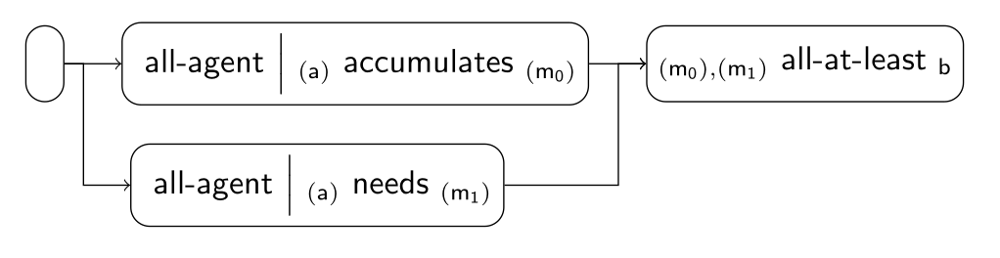
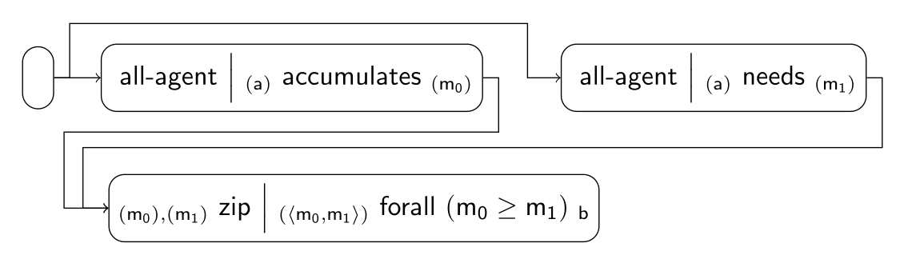

### Equity Scenario

These are some of the implemented fairness tiles for the scenario:

| Index | Tile or Pipeline                              | Class                                              |
|:------|:----------------------------------------------|:---------------------------------------------------|
| 1     | all-agent *(a)*                    | [AllAgentTile][AllAgentTile]                       |
| 2     | *(a)* accumulates *(m)* | [AccumulatesTile][AccumulatesTile]                 |
| 3     | *(a)* needs *(m)*       | [NeedsTile][NeedsTile]                             |
| 4     | *(m)* all-at-least *b*  | [AllAtLeastTile][AllAtLeastTile]                   |
| 5     | composite (1 + 2)                             | [AllAgentAccumulatesTile][AllAgentAccumulatesTile] |
| 6     | composite (1 + 3)                             | [AllAgentNeedsTile][AllAgentNeedsTile]             |
| 7     | pipeline (5 + 6 + 4)                          | [EquityPipeline][EquityPipeline]                   |

Equity can also be modeled as:

| Index | Tile or Pipeline                               | Class                              |
|:------|:-----------------------------------------------|:-----------------------------------|
| 1     | all-agent *(a)*                     | [AllAgentTile][AllAgentTile]       |
| 2     | *(a)* accumulates *(m)*  | [AccumulatesTile][AccumulatesTile] |
| 3     | *(a)* needs *(m)*        | [NeedsTile][NeedsTile]             |
| 4     | *(α),(β)* zip *(⟨α, β⟩)* | [ZipTile][ZipTile]                 |
| 5     | *(α)* forall ϕ *b*       | [ForallTile][ForallTile]           |
| 6     | composite (1 + 2)                              |                                    |
| 7     | composite (1 + 3)                              |                                    |
| 8     | composite (4 + 5)                              |                                    |
| 9     | pipeline (6 + 7 + 8)                           |                                    |

[AllAgentTile]: https://github.com/julianmendez/tiles/blob/master/core/src/main/scala/soda/tiles/fairness/tile/constant/AllAgentTile.soda

[AccumulatesTile]: https://github.com/julianmendez/tiles/blob/master/core/src/main/scala/soda/tiles/fairness/tile/composite/AccumulatesTile.soda

[NeedsTile]: https://github.com/julianmendez/tiles/blob/master/core/src/main/scala/soda/tiles/fairness/tile/derived/map/NeedsTile.soda

[AllAtLeastTile]: https://github.com/julianmendez/tiles/blob/master/core/src/main/scala/soda/tiles/fairness/tile/composite/AllAtLeastTile.soda

[ZipTile]: https://github.com/julianmendez/tiles/blob/master/core/src/main/scala/soda/tiles/fairness/tile/primitive/ZipTile.soda

[ForallTile]: https://github.com/julianmendez/tiles/blob/master/core/src/main/scala/soda/tiles/fairness/tile/composite/ForallTile.soda

[AllAgentAccumulatesTile]: https://github.com/julianmendez/tiles/blob/master/examples/src/main/scala/soda/tiles/fairness/example/pipeline/equity/AllAgentAccumulatesTile.soda

[AllAgentNeedsTile]: https://github.com/julianmendez/tiles/blob/master/examples/src/main/scala/soda/tiles/fairness/example/pipeline/equity/AllAgentNeedsTile.soda

[EquityPipeline]: https://github.com/julianmendez/tiles/blob/master/examples/src/main/scala/soda/tiles/fairness/example/pipeline/equity/EquityPipeline.soda

