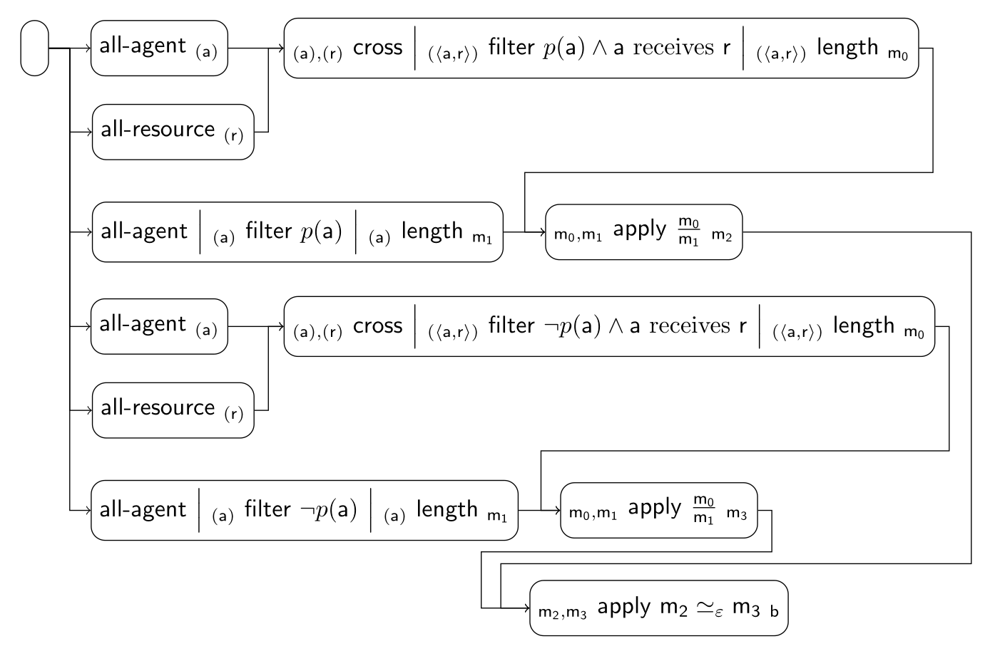

### Group Fairness Scenario

These are some of the implemented fairness tiles for the scenario:

| Index | Tile or Pipeline                                 | Class                                                        |
|:------|:-------------------------------------------------|:-------------------------------------------------------------|
| 1     | all-agent *(a)*                       | [AllAgentTile][AllAgentTile]                                 |
| 2     | all-resource *(r)*                    | [AllResourceTile][AllResourceTile]                           |
| 3     | *(α),(β)* cross *(⟨α, β⟩)* | [CrossTile][CrossTile]                                       |
| 4     | *(α)* filter ϕ *(α)*       | [FilterTile][FilterTile]                                     |
| 5     | *(α)* length *m*           | [LengthTile][LengthTile]                                     |
| 6     | *α* apply ϕ *β*            | [ApplyTile][ApplyTile]                                       |
| 7     | composite (3 + 4 + 5)                            | [CrossFilterPLengthTile][CrossFilterPLengthTile]             |
| 8     | composite (1 + 4 + 5)                            | [AllAgentFilterPLengthTile][AllAgentFilterPLengthTile]       |
| 9     | composite (3 + 4 + 5)                            | [CrossFilterNotPLengthTile][CrossFilterNotPLengthTile]       |
| 10    | composite (1 + 4 + 5)                            | [AllAgentFilterNotPLengthTile][AllAgentFilterNotPLengthTile] |
| 11    | pipeline (6 + 7 + 8 + 9 + 10)                    | [GroupFairnessPipeline][GroupFairnessPipeline]               |

[AllAgentTile]: https://github.com/julianmendez/tiles/blob/master/core/src/main/scala/soda/tiles/fairness/tile/constant/AllAgentTile.soda

[AllResourceTile]: https://github.com/julianmendez/tiles/blob/master/core/src/main/scala/soda/tiles/fairness/tile/constant/AllResourceTile.soda

[CrossTile]: https://github.com/julianmendez/tiles/blob/master/core/src/main/scala/soda/tiles/fairness/tile/primitive/CrossTile.soda

[FilterTile]: https://github.com/julianmendez/tiles/blob/master/core/src/main/scala/soda/tiles/fairness/tile/primitive/FilterTile.soda

[LengthTile]: https://github.com/julianmendez/tiles/blob/master/core/src/main/scala/soda/tiles/fairness/tile/derived/fold/LengthTile.soda

[ApplyTile]: https://github.com/julianmendez/tiles/blob/master/core/src/main/scala/soda/tiles/fairness/tile/primitive/ApplyTile.soda

[ExistsTile]: https://github.com/julianmendez/tiles/blob/master/core/src/main/scala/soda/tiles/fairness/tile/composite/ExistsTile.soda

[CrossFilterPLengthTile]: https://github.com/julianmendez/tiles/blob/master/examples/src/main/scala/soda/tiles/fairness/example/pipeline/groupfairness/CrossFilterPLengthTile.soda

[CrossFilterNotPLengthTile]: https://github.com/julianmendez/tiles/blob/master/examples/src/main/scala/soda/tiles/fairness/example/pipeline/groupfairness/CrossFilterNotPLengthTile.soda

[AllAgentFilterPLengthTile]: https://github.com/julianmendez/tiles/blob/master/examples/src/main/scala/soda/tiles/fairness/example/pipeline/groupfairness/AllAgentFilterPLengthTile.soda

[AllAgentFilterNotPLengthTile]: https://github.com/julianmendez/tiles/blob/master/examples/src/main/scala/soda/tiles/fairness/example/pipeline/groupfairness/AllAgentFilterNotPLengthTile.soda

[GroupFairnessPipeline]: https://github.com/julianmendez/tiles/blob/master/examples/src/main/scala/soda/tiles/fairness/example/pipeline/groupfairness/GroupFairnessPipeline.soda

