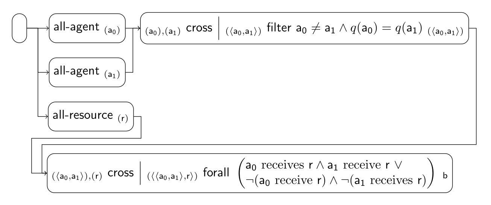

### Individual Fairness Scenario

These are some of the implemented fairness tiles for the scenario:

| Index | Tile or Pipeline                                 | Class                                                    |
|:------|:-------------------------------------------------|:---------------------------------------------------------|
| 1     | all-agent *(a)*                       | [AllAgentTile][AllAgentTile]                             |
| 2     | all-resource *(r)*                    | [AllResourceTile][AllResourceTile]                       |
| 3     | *(α),(β)* cross *(⟨α, β⟩)* | [CrossTile][CrossTile]                                   |
| 4     | *(α)* filter ϕ *(α)*       | [FilterTile][FilterTile]                                 |
| 5     | *(α)* forall *b*           | [ForallTile][ForallTile]                                 |
| 7     | composite (3 + 4)                                | [CrossFilterTile][CrossFilterTile]                       |
| 8     | composite (3 + 5)                                | [CrossForallTile][CrossForallTile]                       |
| 9     | pipeline (1 + 2 + 7 + 8)                         | [IndividualFairnessPipeline][IndividualFairnessPipeline] |

[AllAgentTile]: https://github.com/julianmendez/tiles/blob/master/core/src/main/scala/soda/tiles/fairness/tile/constant/AllAgentTile.soda

[AllResourceTile]: https://github.com/julianmendez/tiles/blob/master/core/src/main/scala/soda/tiles/fairness/tile/constant/AllResourceTile.soda

[CrossTile]: https://github.com/julianmendez/tiles/blob/master/core/src/main/scala/soda/tiles/fairness/tile/primitive/CrossTile.soda

[FilterTile]: https://github.com/julianmendez/tiles/blob/master/core/src/main/scala/soda/tiles/fairness/tile/primitive/FilterTile.soda

[ForallTile]: https://github.com/julianmendez/tiles/blob/master/core/src/main/scala/soda/tiles/fairness/tile/composite/ForallTile.soda

[CrossFilterTile]: https://github.com/julianmendez/tiles/blob/master/examples/src/main/scala/soda/tiles/fairness/example/pipeline/individualfairness/CrossFilterTile.soda

[CrossForallTile]: https://github.com/julianmendez/tiles/blob/master/examples/src/main/scala/soda/tiles/fairness/example/pipeline/individualfairness/CrossForallTile.soda

[IndividualFairnessPipeline]: https://github.com/julianmendez/tiles/blob/master/examples/src/main/scala/soda/tiles/fairness/example/pipeline/individualfairness/IndividualFairnessPipeline.soda

