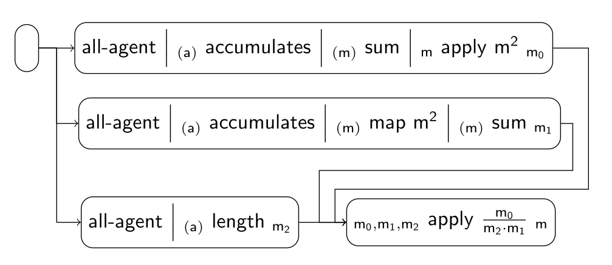

### Jain's Index Scenario

These are some of the implemented fairness tiles for the scenario:

| Index | Tile or Pipeline                              | Class                                                              |
|:------|:----------------------------------------------|:-------------------------------------------------------------------|
| 1     | all-agent *(a)*                    | [AllAgentTile][AllAgentTile]                                       |
| 2     | *(a)* accumulates *(m)* | [AccumulatesTile][AccumulatesTile]                                 |
| 3     | *(m)* sum *m*           | [SumTile][SumTile]                                                 |
| 4     | *(α)* map ϕ *(β)*       | [MapTile][MapTile]                                                 |
| 5     | *(α)* length *m*        | [LengthTile][LengthTile]                                           |
| 6     | *α* apply ϕ *β*         | [ApplyTile][ApplyTile]                                             |
| 7     | composite (1 + 2 + 3 + 6)                     | [AllAgentAccumulatesMapSumTile][AllAgentAccumulatesMapSumTile]     |
| 8     | composite (1 + 2 + 4 + 3)                     | [AllAgentAccumulatesSumApplyTile][AllAgentAccumulatesSumApplyTile] |
| 9     | composite (1 + 5)                             | [AllAgentLengthTile][AllAgentLengthTile]                           |
| 10    | pipeline (6 + 7 + 8 + 9)                      | [JainsIndexPipeline][JainsIndexPipeline]                           |

[AllAgentTile]: https://github.com/julianmendez/tiles/blob/master/core/src/main/scala/soda/tiles/fairness/tile/constant/AllAgentTile.soda

[AccumulatesTile]: https://github.com/julianmendez/tiles/blob/master/core/src/main/scala/soda/tiles/fairness/tile/composite/AccumulatesTile.soda

[SumTile]: https://github.com/julianmendez/tiles/blob/master/core/src/main/scala/soda/tiles/fairness/tile/derived/fold/SumTile.soda

[MapTile]: https://github.com/julianmendez/tiles/blob/master/core/src/main/scala/soda/tiles/fairness/tile/primitive/MapTile.soda

[LengthTile]: https://github.com/julianmendez/tiles/blob/master/core/src/main/scala/soda/tiles/fairness/tile/derived/fold/LengthTile.soda

[ApplyTile]: https://github.com/julianmendez/tiles/blob/master/core/src/main/scala/soda/tiles/fairness/tile/primitive/ApplyTile.soda

[AllAgentAccumulatesMapSumTile]: https://github.com/julianmendez/tiles/blob/master/examples/src/main/scala/soda/tiles/fairness/example/pipeline/jainsindex/AllAgentAccumulatesMapSumTile.soda

[AllAgentAccumulatesSumApplyTile]: https://github.com/julianmendez/tiles/blob/master/examples/src/main/scala/soda/tiles/fairness/example/pipeline/jainsindex/AllAgentAccumulatesSumApplyTile.soda

[AllAgentLengthTile]: https://github.com/julianmendez/tiles/blob/master/examples/src/main/scala/soda/tiles/fairness/example/pipeline/jainsindex/AllAgentLengthTile.soda

[JainsIndexPipeline]: https://github.com/julianmendez/tiles/blob/master/examples/src/main/scala/soda/tiles/fairness/example/pipeline/jainsindex/JainsIndexPipeline.soda

