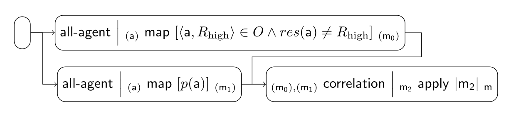

### Scoring Scenario

These are some of the implemented fairness tiles for scoring scenarios:

| Index | Tile or Pipeline                                   | Class                                                        |
|:------|:---------------------------------------------------|:-------------------------------------------------------------|
| 1     | all-agent *(a)*                         | [AllAgentTile][AllAgentTile]                                 |
| 2     | *(α)* map ϕ *(β)*            | [MapTile][MapTile]                                           |
| 3     | *(m0), (m1)* correlation *m* | [CorrelationTile][CorrelationTile]                           |
| 4     | *α* apply ϕ *β*              | [ApplyTile][ApplyTile]                                       |
| 5     | composite (1 + 2)                                  | [AllAgentMapFalsePositiveTile][AllAgentMapFalsePositiveTile] |
| 6     | composite (1 + 2)                                  | [AllAgentMapGroundTruthTile][AllAgentMapGroundTruthTile]     |
| 7     | composite (3 + 4)                                  | [CorrelationAbsTile][CorrelationAbsTile]                     |
| 8     | pipeline (5 + 6 + 7)                               | [UnbiasednessPipeline][UnbiasednessPipeline]                 |

A specific scenario is given as an example in
[ScoringScenarioExample][ScoringScenarioExample]. This scenario is used to test the
scoring scenario tile (unbiasedness with respect to falsepositives) with
[UnbiasednessPipelineSpec][UnbiasednessPipelineSpec].

[AllAgentTile]: https://github.com/julianmendez/tiles/blob/master/core/src/main/scala/soda/tiles/fairness/tile/constant/AllAgentTile.soda

[MapTile]: https://github.com/julianmendez/tiles/blob/master/core/src/main/scala/soda/tiles/fairness/tile/primitive/MapTile.soda

[ApplyTile]: https://github.com/julianmendez/tiles/blob/master/core/src/main/scala/soda/tiles/fairness/tile/primitive/ApplyTile.soda

[CorrelationTile]: https://github.com/julianmendez/tiles/blob/master/core/src/main/scala/soda/tiles/fairness/tile/composite/CorrelationTile.soda

[CorrelationAbsTile]: https://github.com/julianmendez/tiles/blob/master/core/src/main/scala/soda/tiles/fairness/tile/composite/CorrelationAbsTile.soda

[AllAgentMapFalsePositiveTile]: https://github.com/julianmendez/tiles/blob/master/examples/src/main/scala/soda/tiles/fairness/example/pipeline/scoring/AllAgentMapFalsePositiveTile.soda

[AllAgentMapGroundTruthTile]: https://github.com/julianmendez/tiles/blob/master/examples/src/main/scala/soda/tiles/fairness/example/pipeline/scoring/AllAgentMapGroundTruthTile.soda

[UnbiasednessPipeline]: https://github.com/julianmendez/tiles/blob/master/examples/src/main/scala/soda/tiles/fairness/example/pipeline/scoring/UnbiasednessPipeline.soda

[ScoringScenarioExample]: https://github.com/julianmendez/tiles/blob/master/examples/src/test/scala/soda/tiles/fairness/pipeline/scoring/ScoringScenarioExample.soda

[UnbiasednessPipelineSpec]: https://github.com/julianmendez/tiles/blob/master/examples/src/test/scala/soda/tiles/fairness/pipeline/scoring/UnbiasednessPipelineSpec.soda

