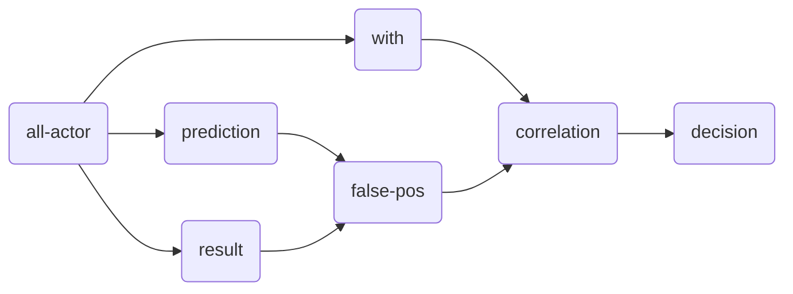

<head>
  
</head>

### Scoring Scenario

These are some of the implemented fairness tiles for scoring scenarios:

| Tile                                               | Class                                          |
|:---------------------------------------------------|:-----------------------------------------------|
| all-actor *(a0), (a1), (a2)*            | [AllActorTripleTile][all-actor-triple-tile]    |
| *(a)* prediction *(m)*       | [PredictionPTile][prediction-p-tile]           |
| *(a)* result *(m)*           | [ResultPTile][result-p-tile]                   |
| *(m0), (m1)* false-pos *(m)* | [FalsePosTile][false-pos-tile]                 |
| *(a)* with *(m)*             | [WithPTile][with-p-tile]                       |
| *(m0), (m1)* correlation *m* | [CorrelationTile][correlation-tile]            |
| *m* decision *b*             | [DecisionTile][decision-tile]                  |
| unbiasedness *b*                        | [UnbiasednessPipeline][unbiassedness-pipeline] |

A specific scenario is given as an example in
[ScoringScenarioExample][scoring-scenario-example]. This scenario is used to test the
scoring scenario tile (unbiasedness with respect to falsepositives) with
[UnbiasednessPipelineSpec][unbiassedness-pipeline-spec].

#### Unbiasedness

[all-actor-triple-tile]: https://github.com/julianmendez/tiles/blob/master/core/src/main/scala/soda/tiles/fairness/tile/AllActorTripleTile.soda
[prediction-p-tile]: https://github.com/julianmendez/tiles/blob/master/core/src/main/scala/soda/tiles/fairness/tile/PredictionPTile.soda
[result-p-tile]: https://github.com/julianmendez/tiles/blob/master/core/src/main/scala/soda/tiles/fairness/tile/ResultPTile.soda
[false-pos-tile]: https://github.com/julianmendez/tiles/blob/master/core/src/main/scala/soda/tiles/fairness/tile/FalsePosTile.soda
[with-p-tile]: https://github.com/julianmendez/tiles/blob/master/core/src/main/scala/soda/tiles/fairness/tile/WithPTile.soda
[correlation-tile]: https://github.com/julianmendez/tiles/blob/master/core/src/main/scala/soda/tiles/fairness/tile/CorrelationTile.soda
[decision-tile]: https://github.com/julianmendez/tiles/blob/master/core/src/main/scala/soda/tiles/fairness/tile/DecisionTile.soda
[unbiassedness-pipeline]: https://github.com/julianmendez/tiles/blob/master/core/src/main/scala/soda/tiles/fairness/pipeline/UnbiasednessPipeline.soda
[scoring-scenario-example]: https://github.com/julianmendez/tiles/blob/master/core/src/test/scala/soda/tiles/fairness/pipeline/ScoringScenarioExample.soda
[unbiassedness-pipeline-spec]: https://github.com/julianmendez/tiles/blob/master/core/src/test/scala/soda/tiles/fairness/pipeline/UnbiasednessPipelineSpec.soda

