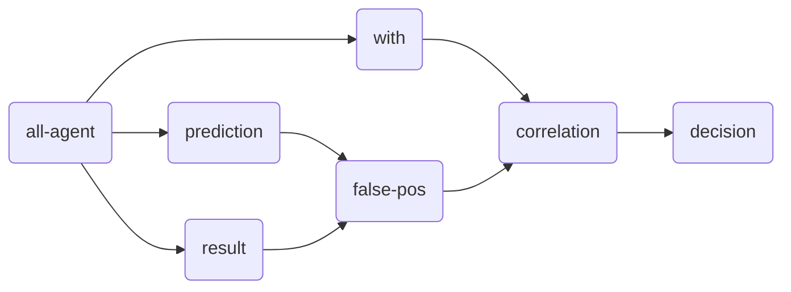

<head>
  
</head>

### Scoring Scenario

These are some of the implemented fairness tiles for scoring scenarios:

| Tile                                               | Class                                        | Formerly  |
|:---------------------------------------------------|:---------------------------------------------|:----------|
| all-agent *(a0), (a1), (a2)*            | [AllAgentTripleTile][AllAgentTripleTile]     | all-actor |
| *(a)* prediction *(m)*       | [PredictionPTile][PredictionPTile]           |           |
| *(a)* result *(m)*           | [MapTile][MapTile]                           |           |
| *(m0), (m1)* false-pos *(m)* | [FalsePosTile][FalsePosTile]                 |           |
| *(a)* with *(m)*             | [MapTile][MapTile]                           |           |
| *(m0), (m1)* correlation *m* | [CorrelationTile][CorrelationTile]           |           |
| *m* decision *b*             | [DecisionTile][DecisionTile]                 |           |
| unbiasedness *b*                        | [UnbiasednessPipeline][UnbiasednessPipeline] |           |

A specific scenario is given as an example in
[ScoringScenarioExample][ScoringScenarioExample]. This scenario is used to test the
scoring scenario tile (unbiasedness with respect to falsepositives) with
[UnbiasednessPipelineSpec][UnbiasednessPipelineSpec].

#### Unbiasedness

[AllAgentTripleTile]: https://github.com/julianmendez/tiles/blob/master/core/src/main/scala/soda/tiles/fairness/tile/constant/AllAgentTripleTile.soda

[PredictionPTile]: https://github.com/julianmendez/tiles/blob/master/core/src/main/scala/soda/tiles/fairness/tile/composite/PredictionPTile.soda

[MapTile]: https://github.com/julianmendez/tiles/blob/master/core/src/main/scala/soda/tiles/fairness/tile/primitive/MapTile.soda

[FalsePosTile]: https://github.com/julianmendez/tiles/blob/master/core/src/main/scala/soda/tiles/fairness/tile/composite/FalsePosTile.soda

[CorrelationTile]: https://github.com/julianmendez/tiles/blob/master/core/src/main/scala/soda/tiles/fairness/tile/composite/CorrelationTile.soda

[DecisionTile]: https://github.com/julianmendez/tiles/blob/master/core/src/main/scala/soda/tiles/fairness/tile/derived/apply/DecisionTile.soda

[UnbiasednessPipeline]: https://github.com/julianmendez/tiles/blob/master/core/src/main/scala/soda/tiles/fairness/pipeline/UnbiasednessPipeline.soda

[ScoringScenarioExample]: https://github.com/julianmendez/tiles/blob/master/core/src/test/scala/soda/tiles/fairness/pipeline/ScoringScenarioExample.soda

[UnbiasednessPipelineSpec]: https://github.com/julianmendez/tiles/blob/master/core/src/test/scala/soda/tiles/fairness/pipeline/UnbiasednessPipelineSpec.soda

