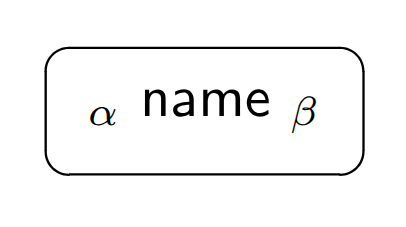
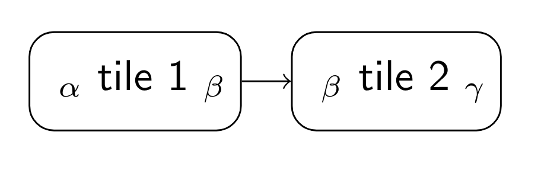
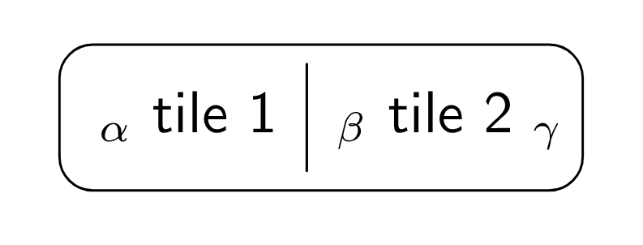
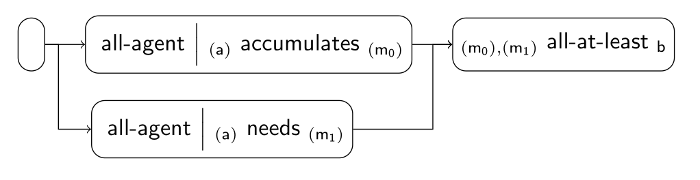

## How it works

**Tiles** is a flexible framework of rigorous representation of functions aimed at clarity and scalability.
The framework is based on concepts of modular design, especially
*encapsulation*, *reusability*, *interchangeability*, *cohesion*, *low coupling*, *scalability*, and *testability*.

With **Tiles**, we refer to:

- a framework where functions can be combined to create descriptions,
- a graphical representation of the framework, and
- an implementation of the framework.

### Tiles

Each block, called *tile*, has a *name*, a *function*, an *input type*, an *output type*, and
*contextual information* (e.g. constants and auxiliary functions).
This is denoted as follows, where α is the input type, β is the output type, and 'name'
is the function name:

|                                    |
|------------------------------------|
| *α* name *β* |

Graphically, this is represented as:

If the tile is a constant, the input type is omitted.

### Types

Types in **Tiles** are:

- *Atomic*: `a` (agent), `r` (resource), `m` (measure), `b` (Boolean).
- *Tuple*: ⟨α_1, …, α_n⟩
- *Sequence*: (α)

The type *measure* is a type that represents quantities, like integer numbers and floating point numbers, and may
include an undefined element (⊥).

The type annotation follows [this grammar][type-annotation-grammar].

### Primitive tiles

The primitive tiles are basic blocks, such that their definitions do not depend on other tiles.

Some tiles may be *polymorphic* or *parametric*.
*Polymorphic tiles* are tiles such that the input or output types are generic, such as α, β, and they are instantiated
when they connected to other tiles.
*Parametric tiles* are tiles such that the main function depends on another function φ provided as a parameter.

These are the primitive tiles.

| Function                                         | Implementation               |
|--------------------------------------------------|------------------------------|
| *(α),(β)* cross *(⟨α, β⟩)* | [CrossTile][CrossTile]       |
| *(α),(β)* zip *(⟨α, β⟩)*   | [ZipTile][ZipTile]           |
| *(α)* distinct *(α)*       | [DistinctTile][DistinctTile] |
| *(α)* filter φ *(α)*       | [FilterTile][FilterTile]     |
| *(α)* map φ *(β)*          | [MapTile][MapTile]           |
| *α* apply φ *β*            | [ApplyTile][ApplyTile]       |
| *(α)* fold *z* using φ *β* | [FoldTile][FoldTile]         |

Some tiles are directly derived from primitive tiles by instantiating some parameter.
For example:

| Function                               | Implementation           |
|----------------------------------------|--------------------------|
| *(α)* sum φ *m*  | [SumPhiTile][SumPhiTile] |
| *(m)* sum *m*    | [SumTile][SumTile]       |
| *(α)* length *m* | [LengthTile][LengthTile] |

The tile

|                                       |
|---------------------------------------|
| *(α)* sum φ *m* |

is further instantiated to create

|                                     |
|-------------------------------------|
| *(m)* sum *m* |

and

|                                        |
|----------------------------------------|
| *(α)* length *m* |

### Constants

The *constants* are special type of tiles that provide the constants in a deterministic way.
For example, the order of elements for all-agent and for all-resources is always known and always the same.

| Function                      | Implementation                     |
|-------------------------------|------------------------------------|
| all-agent *(a)*    | [AllAgentTile][AllAgentTile]       |
| all-resource *(r)* | [AllResourceTile][AllResourceTile] |

### Composite tiles

A *composite tile* is created by connecting two or more tiles.
Assume that

|                                      |
|--------------------------------------|
| *α* tile 1 *β* |

is connected to

|                                      |
|--------------------------------------|
| *β* tile 2 *γ* |

They can be connected together to form the composite tile

|                                                              |
|--------------------------------------------------------------|
| *α* tile 1 ⏐ *β* tile 2 *γ* |

The composite tile of the example can also be denoted as

|                                               |
|-----------------------------------------------|
| *α* tile 2 ◦ tile 1 *γ* |

Graphically, this is represented as:

Some composite tiles receive special names because they are or can be used in multiple places.
For example:

| Function                                      | Implementation                     |
|-----------------------------------------------|------------------------------------|
| *(a)* accumulates *(m)* | [AccumulatesTile][AccumulatesTile] |
| *(α)* exists φ *b*      | [ExistsTile][ExistsTile]           |

### Pipelines

Multiple tiles can be connected to create a *pipeline*.
Each pipeline should have a single *start point* and a single *end point*.
To unify the generation of actors and resources, an empty tile is added at the beginning of the pipeline.

Graphically, we can represent [equity][equity-example] with the following pipeline:

[MapTile]: https://github.com/julianmendez/tiles/blob/master/core/src/main/scala/soda/tiles/fairness/tile/primitive/MapTile.soda

[ApplyTile]: https://github.com/julianmendez/tiles/blob/master/core/src/main/scala/soda/tiles/fairness/tile/primitive/ApplyTile.soda

[CrossTile]: https://github.com/julianmendez/tiles/blob/master/core/src/main/scala/soda/tiles/fairness/tile/primitive/CrossTile.soda

[FilterTile]: https://github.com/julianmendez/tiles/blob/master/core/src/main/scala/soda/tiles/fairness/tile/primitive/FilterTile.soda

[DistinctTile]: https://github.com/julianmendez/tiles/blob/master/core/src/main/scala/soda/tiles/fairness/tile/primitive/DistinctTile.soda

[ZipTile]: https://github.com/julianmendez/tiles/blob/master/core/src/main/scala/soda/tiles/fairness/tile/primitive/ZipTile.soda

[FoldTile]: https://github.com/julianmendez/tiles/blob/master/core/src/main/scala/soda/tiles/fairness/tile/primitive/FoldTile.soda

[AllAgentTile]: https://github.com/julianmendez/tiles/blob/master/core/src/main/scala/soda/tiles/fairness/tile/constant/AllAgentTile.soda

[AllResourceTile]: https://github.com/julianmendez/tiles/blob/master/core/src/main/scala/soda/tiles/fairness/tile/constant/AllResourceTile.soda

[AccumulatesTile]: https://github.com/julianmendez/tiles/blob/master/core/src/main/scala/soda/tiles/fairness/tile/composite/AccumulatesTile.soda

[SumPhiTile]: https://github.com/julianmendez/tiles/blob/master/core/src/main/scala/soda/tiles/fairness/tile/derived/fold/SumPhiTile.soda

[SumTile]: https://github.com/julianmendez/tiles/blob/master/core/src/main/scala/soda/tiles/fairness/tile/derived/fold/SumTile.soda

[LengthTile]: https://github.com/julianmendez/tiles/blob/master/core/src/main/scala/soda/tiles/fairness/tile/derived/fold/LengthTile.soda

[ExistsTile]: https://github.com/julianmendez/tiles/blob/master/core/src/main/scala/soda/tiles/fairness/tile/composite/ExistsTile.soda

[type-annotation-grammar]: https://julianmendez.github.io/tiles/grammar.txt

[equity-example]: https://julianmendez.github.io/tiles/example/equity/equity_example.html

